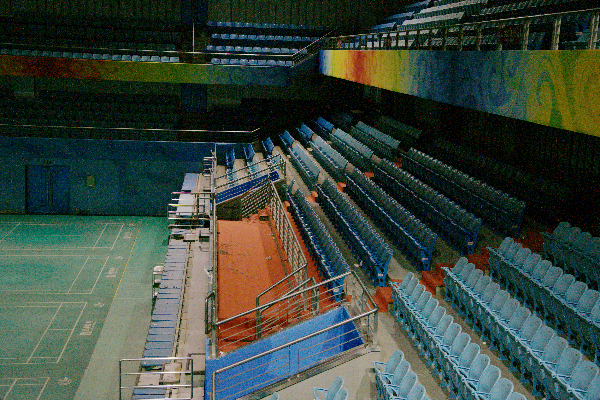
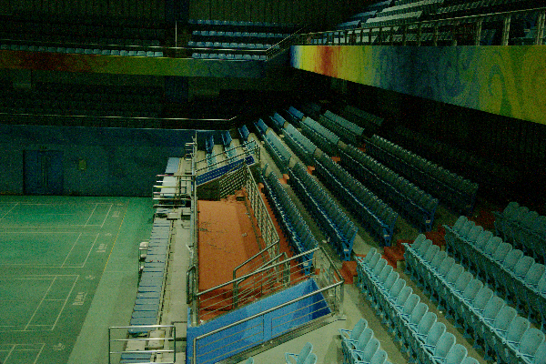
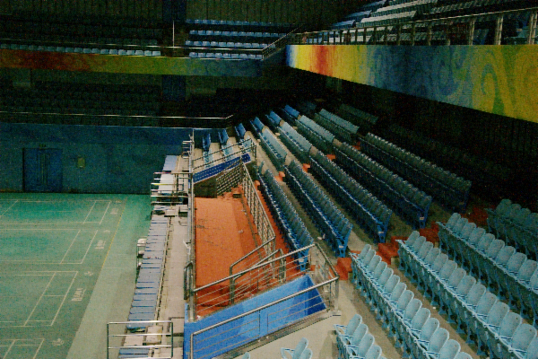

# 🌓 Low Light Image Enhancement Without Ground Truth or Paired Training Data

This project implements the **Zero-Reference Deep Curve Estimation (Zero-DCE)** approach from the [ZeroDCE paper](https://arxiv.org/pdf/2001.06826), aimed at enhancing low-light images without the need for ground truth or paired training data. We focus on learning a mapping curve for image correction, while also addressing the **noise artifacts** that emerge in enhanced outputs by integrating various **loss functions** and **architectural tweaks** into the base model — **without explicit denoising modules**.

---

## 📂 Dataset

We use the [LoL Dataset](https://www.kaggle.com/datasets/soumikrakshit/lol-dataset), which contains:
- **485 training images**
- **15 testing images**

Each image pair includes a low-light input and a ground truth version. However, in keeping with the **Zero-DCE** philosophy, **only the low-light images** are used during training.

---

## 🧠 Models & Methods

All models are based on the **Zero-DCE backbone**, with only ~80,000 parameters. The original method uses **four non-reference loss functions**:

- 📏 **Spatial Consistency Loss**
- 🔆 **Exposure Control Loss**
- 🌫️ **Illumination Smoothness Loss**
- 🎨 **Color Constancy Loss**

We propose three model variations:

| Model     | Added Techniques | Loss Weights | SSIM (w/ GT) |
|-----------|------------------|--------------|--------------|
| **Model 1** | Baseline (Zero-DCE) | Spatial: 1, Exposure: 2, Smoothness: 10000, Color: 1 | 67% |
| **Model 2** | + Total Variation Loss | Spatial: 1, Exposure: 5, Smoothness: 10000, Color: 3, TV: 10 | 69% |
| **Model 3** | + 2 lightweight CNNs for noise estimation<br>+ Self-supervised loss (as in [Noise2Noise](https://arxiv.org/pdf/2303.11253)) | Original 4 + self-supervised loss | **77%** |

---

## 📸 Visual Results

### 🔅 Input vs Output Enhancements

Below are enhancement results for a sample low-light image:

- **Low Light Image**  
  

- **Model 1 Output**  
  

- **Model 2 Output**  
  

- **Model 3 Output**  
  

- **Ground Truth**  
  


---

## 🧱 Folder Structure

```
low_light_enhancement/
├── data/                 # Contains training/testing low-light images
├── models/               # Saved model weights
├── dataset.py            # Dataset for model training and evaluation
├── DCENet.py             # Model architecture and custom loss function
├── ssim.py               # Structural Similarity Index implementation
├── trainer.py            # Script to train the model
└── evaluate.py           # Calculate evaluation metrics on test data
```

---

## 📌 Summary

This project extends Zero-DCE to reduce noise and improve quality by modifying both **loss formulation** and **network architecture**, without relying on paired supervision or separate denoising stages — resulting in significant SSIM improvement and cleaner enhanced images.
